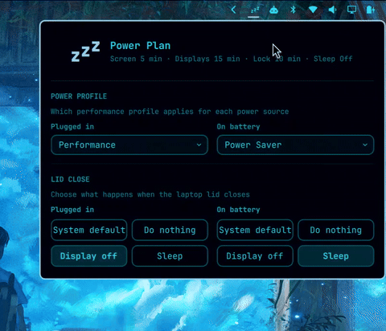

# Power Plan

## Install

```sh
omarchy plugin add https://github.com/ValleytheKnight/omarchy-powerplan-widget.git --enable
```

That is the whole plugin. Everything except the hibernate delay works
with no further setup.

### Hibernate delay (optional)

Setting a hibernate delay writes to `/etc/systemd/sleep.conf.d/`, so it
needs a small root-owned helper. The helper is one exact, signed
package, `omarchy-powerplan-helper` **0.1.0**. There is no pacman
repository and no `pacman -Syu` for it: installing it is a deliberate,
one-time action bound to this exact version, not a channel that can
later serve different bytes under the same trust.

Trust the signing key once per machine. It is fetched from a public
keyserver, not from this repository:

```sh
sudo pacman-key --keyserver hkps://keyserver.ubuntu.com --recv-keys A8238083DE096BC875CD1EB572BD2077B316056A
sudo pacman-key --lsign-key A8238083DE096BC875CD1EB572BD2077B316056A
```

Download this version's package and verify its digest before
installing it. The published SHA-256 below is the trust anchor for
these bytes; check it against this file and against the release page,
not only the number printed by the download:

```sh
curl -LO https://github.com/ValleytheKnight/omarchy-powerplan-widget/releases/download/helper-v0.1.0/omarchy-powerplan-helper-0.1.0-1-any.pkg.tar.zst
curl -LO https://github.com/ValleytheKnight/omarchy-powerplan-widget/releases/download/helper-v0.1.0/omarchy-powerplan-helper-0.1.0-1-any.pkg.tar.zst.sig
sha256sum omarchy-powerplan-helper-0.1.0-1-any.pkg.tar.zst
# must print 216b653ab15529f967e0fe98f5c6999e8e5bf3ea6d91f4460ace621665c0692e
```

Then install it, and restart the shell if it is already running:

```sh
sudo pacman -U ./omarchy-powerplan-helper-0.1.0-1-any.pkg.tar.zst
omarchy restart shell
```

`pacman -U` also checks the package's detached signature against the
key you locally signed before it will install anything, so the digest
check above and pacman's own signature check are independent of each
other.

A later helper version is a new pkgver, a new tag, a new published
SHA-256, and a new security review, not an automatic upgrade under this
approval. Check this page again before moving to one; do not run a
blanket `pacman -Syu` expecting it to reach this package, since no
repository stanza points pacman at it.

#### What is trusted, and what is not

No step above reads anything from a clone of this repository. The key
comes from a public keyserver. The package comes from a specific,
versioned GitHub release URL over TLS, verified two ways before it
touches anything: the SHA-256 you check by hand, and the detached
signature `pacman -U` checks against the key you locally signed, using
pacman's own root-owned keyring.

The only value you have to get right is the 40-character fingerprint.
It is the entire trust anchor for the key. `pacman-key --lsign-key`
grants trust to the key with exactly that fingerprint and to no other,
so substituted key material cannot become trusted regardless of where
its bytes came from. That fingerprint is published on the keyserver
above and on this repository's release page. Check it against one of
those rather than against a file on your own machine. The published
SHA-256 is the separate anchor for which package those trusted
signatures are allowed to belong to; both have to match.

Residual risk: anything already running as your user can rewrite this
README before you read it, including the fingerprint and digest printed
in it, and can reuse a cached `sudo` credential from the commands above
to run pacman directly. No install document closes that, which is why
the fingerprint is also published somewhere other than this machine.
This is the same bootstrap that every third-party Arch package and
every distribution keyring depends on.

Two limits worth naming. pacman has no per-package key pinning, so a
locally signed key is trusted for any package presented to `pacman -U`,
not only this one; that is exactly why installing a specific,
digest-verified file rather than pointing pacman at a repository
matters here. And `omarchy-powerplan-helper` contains one Python script
and no install scriptlet, so installing it runs no code as root.

If needed, add the plugin to the bar explicitly:

```sh
omarchy bar plugin add valleytheknight.powerplan --section right
```

## Overview

Set screensaver, displays-off, auto-lock, sleep, hibernate, and lid-close
behavior independently for plugged in versus on battery, from the Omarchy
Quattro bar.


On laptops, Power Plan also shows lid-close actions, split the same way:




Power Plan provides seven controls, each set independently for **Plugged in**
and **On battery**:

- **Lid close**: keeps the system default or does nothing, turns off the laptop display, suspends, or hibernates when the lid closes.
- **Screen saver**: starts the screen saver after the selected period of inactivity.
- **Displays off**: turns the displays off (DPMS) after the selected period of inactivity while respecting idle inhibitors.
- **Auto-lock**: locks the session after the selected period of inactivity.
- **Sleep**: suspends the computer after the selected period of inactivity while respecting idle inhibitors.
- **Hibernate after sleep**: wakes a suspended computer after the selected delay and hibernates it.
- **Power profile**: picks which Omarchy power profile applies on AC versus battery.

Each timeout offers presets, Off, and a custom hours/minutes/seconds entry.
Omarchy requires positive screen-saver and lock values, so Power Plan
simulates Off with safe seven-day timeouts while displaying and persisting
Off as `0`.

## Usage

Click the bar icon and choose a lid-close action or a timeout for each idle
stage, once for **Plugged in** and once for **On battery**. Presets apply
immediately; Custom accepts hours, minutes, and seconds, and applies on
confirmation for screen saver, displays off, auto-lock, sleep, and
hibernate-after-sleep. Existing values that do not match a preset open as
Custom. Changes survive shell reloads and reboots, and take effect
immediately when the power source changes.

The lid controls appear only when UPower reports a laptop lid. **System
default** leaves logind in charge. The other actions use a low-level
lid-switch inhibitor while Power Plan is running, then handle the event
without changing system-wide logind configuration. For managed lid actions,
Power Plan also installs a small managed block in `~/.config/hypr/bindings.lua`
that replaces Omarchy's default `switch:on:Lid Switch` binding. Omarchy's
default binding locks immediately on lid close, before Power Plan can apply
**Do nothing** or **Display off**, so Power Plan unbinds it and keeps only
Omarchy's clamshell monitor reconciliation. Selecting **System default**
removes Power Plan's managed Hyprland block again. **Display off** targets
the internal eDP/LVDS/DSI output and turns it back on when the lid opens.
Hibernate is selectable only when logind reports that it is available.

Power Plan stores its state in `~/.config/omarchy/powerplan.json`, as an
`{ac, battery}` pair for every setting. The effective screen-saver and
auto-lock values for whichever power source is active right now stay
mirrored into Omarchy's standard `~/.config/omarchy/shell.json`; lid
actions, and the displays-off, sleep, and hibernate-after-sleep timers, are
handled by Power Plan itself and are not written there. Changing the
hibernate delay asks for administrator authorization because systemd's RTC
wake timer is configured system-wide, and only one side of the AC/battery
pair can be the active configured value at any moment.

## How displays off works

Power Plan uses Quickshell's idle monitor with inhibitor support and turns
the displays off through Hyprland's `dpms` dispatcher. Applications holding
an idle inhibitor can prevent the timer from firing, and any key press or
mouse movement turns the displays back on.

## How sleep and hibernate work

Power Plan uses Quickshell's idle monitor with inhibitor support and
requests suspend through `systemctl suspend`. Applications holding an idle
inhibitor can prevent the timer from firing, and system-level sleep
inhibitors can reject the suspend request.

When **Hibernate after sleep** is enabled, Power Plan instead requests
`systemctl suspend-then-hibernate`. systemd sets an RTC wake alarm, wakes
after the chosen delay, and hibernates. Power Plan stores the delay in
`/etc/systemd/sleep.conf.d/90-powerplan.conf`; changing or disabling it
requires administrator authorization. The option is available only when
logind reports that suspend-then-hibernate is supported. When it is
unavailable, Power Plan disables the positive timeout choices and reports
any prerequisite it can detect, including missing disk-backed swap, missing
kernel hibernation support, missing resume discovery, or restrictive kernel
lockdown. **Off** remains available so an old setting can always be cleared.

## Requirements

- Omarchy Quattro
- Python 3
- systemd
- UPower
- GLib (`gdbus`)
- Polkit (`pkexec`), to change the systemd hibernate delay
- `pacman-key` (part of pacman), to install and verify the privileged helper

The helper is deliberately separate from `powerplan.py`, because the latter
is loaded from the user-owned plugin directory and must never be executed
as root.

## Validate

```sh
npm test
omarchy plugin validate .
./scripts/lint-qml
```

`lint-qml` calls Qt6's `qmllint` (`/usr/lib/qt6/bin/qmllint`) explicitly
rather than whatever `qmllint` resolves to on `PATH`: on a system with
both Qt5 and Qt6 installed, the plain command usually resolves to Qt5's
build, which can't resolve this project's Qt6 Quickshell module types
and aborts silently (no output, no crash dump) instead of reporting an
error. It also aliases the `qs` namespace Quickshell registers for its
own shell root at runtime, which a bare `-I` path can't resolve on its
own; without that alias, every type `qs.Commons`/`qs.Ui` would have
provided cascades into unrelated-looking warnings throughout every file.

With both of those fixed, 39 warnings remain, all from typing this
project doesn't own: the `bar` context object Quickshell hands every
bar widget is typed as a plain `QtObject`, so member access on it can't
be statically verified; the same is true of `Style.font` in the shared
Omarchy shell's `Commons/Style.qml`, whose `font` property is a plain
`QtObject` rather than a named type with declared properties; and
`Quickshell.Io`'s `Process.exited` signal's second parameter type
(`QProcess::ExitStatus`) isn't resolvable by qmllint even when a
handler declares it explicitly (confirmed by testing a minimal handler
in isolation), so every `onExited` handler warns regardless of what it
does. None of these are fixable by editing this plugin's own files.

## Remove

```sh
omarchy plugin remove valleytheknight.powerplan
rm -f ~/.config/omarchy/powerplan.json
sudo rm -f /etc/systemd/sleep.conf.d/90-powerplan.conf
sudo pacman -Rns omarchy-powerplan-helper
```

Removing Power Plan does not revert the screen-saver and lock timeouts
already written to `shell.json`. If Power Plan is removed while a managed
lid action is selected, remove the managed block between `-- BEGIN Power
Plan lid action override` and `-- END Power Plan lid action override` from
`~/.config/hypr/bindings.lua`, or reinstall Power Plan and select **System
default** before removing it.

This matters if either setting was left **Off** for the currently active
power source. Off is stored in `shell.json` as a seven-day timeout, so
removing Power Plan while auto-lock is Off leaves a machine that
effectively never locks, with no Power Plan UI left to notice it. Set
anything you want back on *before* removing, or restore Omarchy's defaults
afterwards:

```sh
python3 - <<'PY'
import json, pathlib
path = pathlib.Path.home() / ".config/omarchy/shell.json"
config = json.loads(path.read_text())
config.setdefault("idle", {}).update({"screensaver": 150, "lock": 300})
path.write_text(json.dumps(config, indent=2) + "\n")
PY
```

## Fork

Power Plan is a fork of [Sandman](https://github.com/lgse/sandman) by Pierre
Berube, MIT licensed. See [`NOTICE.md`](NOTICE.md) for what changed.

## License

MIT
