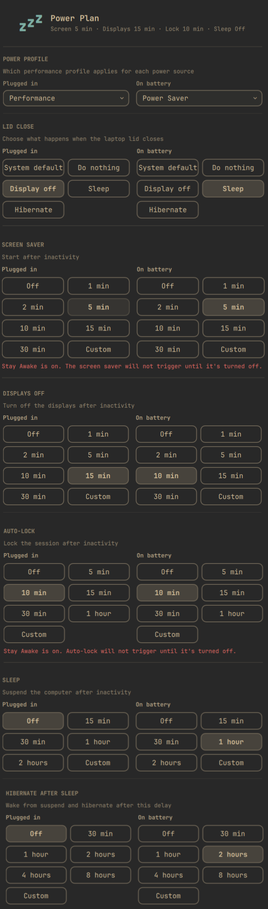
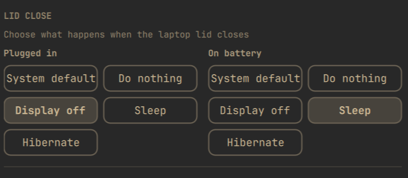

# Power Plan

Set screensaver, displays-off, auto-lock, sleep, hibernate, and lid-close
behavior independently for plugged in versus on battery, from the Omarchy
Quattro bar.



On laptops, Power Plan also shows lid-close actions, split the same way:



Power Plan provides seven controls, each set independently for **Plugged in**
and **On battery**:

- **Lid close**: keeps the system default or does nothing, turns off the laptop display, suspends, or hibernates when the lid closes.
- **Screen saver**: starts the screen saver after the selected period of inactivity.
- **Displays off**: turns the displays off (DPMS) after the selected period of inactivity while respecting idle inhibitors.
- **Auto-lock**: locks the session after the selected period of inactivity.
- **Sleep**: suspends the computer after the selected period of inactivity while respecting idle inhibitors.
- **Hibernate after sleep**: wakes a suspended computer after the selected delay and hibernates it.
- **Power profile**: picks which Omarchy power profile applies on AC versus battery.

Each timeout offers presets, Off, and a custom hours/minutes/seconds entry.
Omarchy requires positive screen-saver and lock values, so Power Plan
simulates Off with safe seven-day timeouts while displaying and persisting
Off as `0`.

## Install

```sh
omarchy plugin add https://github.com/ValleytheKnight/omarchy-powerplan-widget.git --enable
```

Install the privileged helper from the user-owned plugin checkout, then
restart the shell if it is already running:

```sh
sudo install -D -o root -g root -m 0755 \
  ~/.config/omarchy/plugins/valleytheknight.powerplan/powerplan-configure-hibernate \
  /usr/local/libexec/powerplan-configure-hibernate
omarchy restart shell
```

If needed, add it to the bar explicitly:

```sh
omarchy bar plugin add valleytheknight.powerplan --section right
```

## Usage

Click the bar icon and choose a lid-close action or a timeout for each idle
stage, once for **Plugged in** and once for **On battery**. Presets apply
immediately; Custom accepts hours, minutes, and seconds, and applies on
confirmation for screen saver, displays off, auto-lock, sleep, and
hibernate-after-sleep. Existing values that do not match a preset open as
Custom. Changes survive shell reloads and reboots, and take effect
immediately when the power source changes.

The lid controls appear only when UPower reports a laptop lid. **System
default** leaves logind in charge. The other actions use a low-level
lid-switch inhibitor while Power Plan is running, then handle the event
without changing system-wide logind configuration. For managed lid actions,
Power Plan also installs a small managed block in `~/.config/hypr/bindings.lua`
that replaces Omarchy's default `switch:on:Lid Switch` binding. Omarchy's
default binding locks immediately on lid close, before Power Plan can apply
**Do nothing** or **Display off**, so Power Plan unbinds it and keeps only
Omarchy's clamshell monitor reconciliation. Selecting **System default**
removes Power Plan's managed Hyprland block again. **Display off** targets
the internal eDP/LVDS/DSI output and turns it back on when the lid opens.
Hibernate is selectable only when logind reports that it is available.

Power Plan stores its state in `~/.config/omarchy/powerplan.json`, as an
`{ac, battery}` pair for every setting. The effective screen-saver and
auto-lock values for whichever power source is active right now stay
mirrored into Omarchy's standard `~/.config/omarchy/shell.json`; lid
actions, and the displays-off, sleep, and hibernate-after-sleep timers, are
handled by Power Plan itself and are not written there. Changing the
hibernate delay asks for administrator authorization because systemd's RTC
wake timer is configured system-wide, and only one side of the AC/battery
pair can be the active configured value at any moment.

## How displays off works

Power Plan uses Quickshell's idle monitor with inhibitor support and turns
the displays off through Hyprland's `dpms` dispatcher. Applications holding
an idle inhibitor can prevent the timer from firing, and any key press or
mouse movement turns the displays back on.

## How sleep and hibernate work

Power Plan uses Quickshell's idle monitor with inhibitor support and
requests suspend through `systemctl suspend`. Applications holding an idle
inhibitor can prevent the timer from firing, and system-level sleep
inhibitors can reject the suspend request.

When **Hibernate after sleep** is enabled, Power Plan instead requests
`systemctl suspend-then-hibernate`. systemd sets an RTC wake alarm, wakes
after the chosen delay, and hibernates. Power Plan stores the delay in
`/etc/systemd/sleep.conf.d/90-powerplan.conf`; changing or disabling it
requires administrator authorization. The option is available only when
logind reports that suspend-then-hibernate is supported. When it is
unavailable, Power Plan disables the positive timeout choices and reports
any prerequisite it can detect, including missing disk-backed swap, missing
kernel hibernation support, missing resume discovery, or restrictive kernel
lockdown. **Off** remains available so an old setting can always be cleared.

## Requirements

- Omarchy Quattro
- Python 3
- systemd
- UPower
- GLib (`gdbus`)
- Polkit (`pkexec`), to change the systemd hibernate delay

The helper is deliberately separate from `powerplan.py`, because the latter
is loaded from the user-owned plugin directory and must never be executed
as root.

## Validate

```sh
npm test
omarchy plugin validate .
qmllint -I "$OMARCHY_PATH/shell" BarWidget.qml Panel.qml Service.qml LidService.qml TimeoutColumn.qml TimeoutSection.qml LidActionColumn.qml
```

## Remove

```sh
omarchy plugin remove valleytheknight.powerplan
rm -f ~/.config/omarchy/powerplan.json
sudo rm -f /etc/systemd/sleep.conf.d/90-powerplan.conf
sudo rm -f /usr/local/libexec/powerplan-configure-hibernate
```

Removing Power Plan does not revert the screen-saver and lock timeouts
already written to `shell.json`. If Power Plan is removed while a managed
lid action is selected, remove the managed block between `-- BEGIN Power
Plan lid action override` and `-- END Power Plan lid action override` from
`~/.config/hypr/bindings.lua`, or reinstall Power Plan and select **System
default** before removing it.

This matters if either setting was left **Off** for the currently active
power source. Off is stored in `shell.json` as a seven-day timeout, so
removing Power Plan while auto-lock is Off leaves a machine that
effectively never locks, with no Power Plan UI left to notice it. Set
anything you want back on *before* removing, or restore Omarchy's defaults
afterwards:

```sh
python3 - <<'PY'
import json, pathlib
path = pathlib.Path.home() / ".config/omarchy/shell.json"
config = json.loads(path.read_text())
config.setdefault("idle", {}).update({"screensaver": 150, "lock": 300})
path.write_text(json.dumps(config, indent=2) + "\n")
PY
```

## Fork

Power Plan is a fork of [Sandman](https://github.com/lgse/sandman) by Pierre
Berube, MIT licensed. See [`NOTICE.md`](NOTICE.md) for what changed.

## License

MIT
